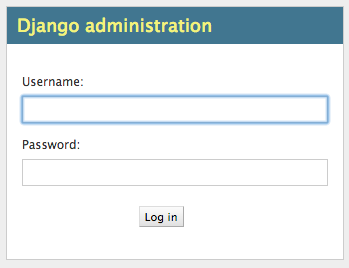
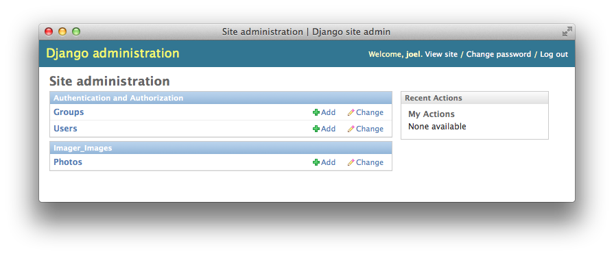
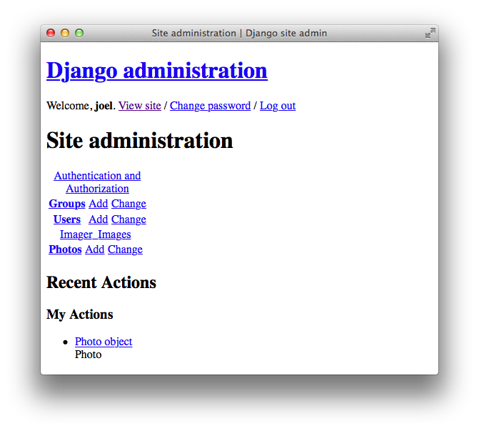

# Files in Django

In this lecture we will go over dealing with files and the filesystem when
working with Django. Our site works with binary data in the form of files.
These files represent book covers that our users upload to our system. We’ll
go over how to set up our models and filesystem to make all of this work.

* * *

## A New Application

Django encourages developers to build individual units of functionality for a
site in individual _apps_. Imagine for a moment a website that caters to comic
book fans. It might have a system for listing given comic book titles,
different runs within each title, and then individual issues. This system
would be an “app”.

Perhaps the site might also have a forum section, where users can open and
participate in discussions about their favorite comic books. This forum would
likely be a separate app.

The app is used in this site to discuss comic books. But if it is well
written, there would be nothing that prevents it from being used in a
different website to discuss other topics.

We already have one app in our Django Lender site. It manages user profiles
for us. But there is no reason that app should also contain the models and
views needed to manage books.

We need to start a new app that will represent the book management portion of
our website. Move into your `django_lender` site directory (with the
`manage.py`). Start a new app:


```sh
$ python manage.py startapp lender_books
```

We can begin by starting to build our model:

_/.../lending_library/lender_books_


```python
from django.db import models
import datetime


class Book(models.Model):
    cover_image = models.ImageField
    title = models.CharField(max_length=255)
    author = models.CharField(max_length=255)

    YEARS = [(year, year)
         for year in range(1, datetime.datetime.now().year + 1)][::-1]
    year = models.IntegerField(choices=YEARS, default=2016)

    BOOK_STATUS = [
        ("available", "Available"),
        ("checked out", "Checked Out")
    ]
    status = models.CharField(
        max_length=20,
        choices=BOOK_STATUS,
        default="available"
    )
    date_added = models.DateTimeField(auto_now_add=True)
    last_borrowed = models.DateTimeField(auto_now=True)
```

Let’s start with a `cover_image` field: `cover_image = models.ImageField`.
Django has 2 types of fields when dealing with binary files, the `ImageField`
and the `FileField`. Images are just files that have special properties like
`height` and `width`. Django comes with this functionality built in with
`ImageField`.

When we construct these models, there are a few options we really want to
think about. The first of these is
[`upload_to`](https://docs.djangoproject.com/en/2.0/ref/models/fields/#django.db.models.FileField.upload_to).

## Files and Media

Here is our
[`FileField`](https://docs.djangoproject.com/en/2.0/ref/models/fields/#filefield)
constructor (source code in `.../lib/python3.6/site-
packages/django/db/models/fields/files.py`):

`class FileField(upload_to=None, max_length=100, **options)`

  * It takes `upload_to=None` as a default.
  * It takes `max_length=100` as a default.
  * It takes `**options` (more on these later).

`upload_to` represents a filesystem path where we will store these images.
Django keeps track for you of a place called `MEDIA_ROOT`. We need to add this
to `settings.py`. It’s not a default setting because not all sites require the
ability to upload files.

If we look in our `settings.py` file, you’ll see a setting called `BASE_DIR =
os.path.dirname(os.path.dirname(os.path.abspath(__file__)))`. This is a bit
confusing, but here is what it does.

`os.path.abspath(__file__)` being called with `__file__` as an argument gives
us the absolute path to this particular `settings.py` file, no matter what
system we’re on. The path gets returned as a string.

Calling `os.path.dirname()` with that returned string as an argument hands us
back everything in the path _except_ the last path segment. In this case, that
strips the filename and leaves us with the path to the directory containing
the ` settings.py` file, our configuration root. So if our absolute path to
`settings.py` was `"/Users/Nick/lending_library/lending_library/settings.py"`
then
`os.path.dirname("/Users/Nick/lending_library/lending_library/settings.py")`
would return `"/Users/Nick/lending_library/lending_library"`.

Calling `dirname()` again on that returned value strips the last path segement
once more. That gives us the path to the directory that contains our
configuration root, the project root:


```sh
$ tree .
.
├── lender_books
│   ├── __init__.py
│   ├── admin.py
...
├── lending_library
│   ├── __init__.py
│   ├── __init__.pyc
│   ├── settings.py
...
└── manage.py
```

So in our current directory structure, we would be setting `BASE_DIR` to the
directory one level above our `settings.py`. This is the directory in which
`manage.py` is located.

The way that `startproject` works, it always gives you this structure. You can
rename the top-level site directory if you want to, but do not change the name
of the directory with your `settings.py` file. The reason for this is because
in your `manage.py` file, it refers to your `lending_library.settings`. You
would need to start renaming things in other places as well, or your site will
stop working properly.

## MEDIA_ROOT

So if we want to construct a path name, what will we use? The `os` module from
the Python standard library provides us with `os.path.join()`. What does
`.join()` take? Path segments that get joined together. So we can set up our
`MEDIA_ROOT` like so:

_/.../lending_library/lending_library/settings.py_


```python
...
 # Media file handling
MEDIA_ROOT = os.path.join(BASE_DIR, 'media')
```

Now our `MEDIA_ROOT` is set to be a folder called `media` that’s in our
project’s root directory. We will need to create that folder.

You wouldn’t want to add a bunch of testing images or things your users upload
as versioned items in your github repo. But simply adding the `media`
directory to `.gitignore` in this way will make it so that git doesn’t track
the `media` directory at all (git doesn’t track empty directories). And since
Django itself will not create that directory on our behalf, this opens up a
quandry. We want this folder as a part of our project structure, but we don’t
want anything inside it.

The best way to accomplish this is to go into the `media` directory and add a
file called `.gitkeep`. This file could really be called anything, `.gitkeep`
is just a convention. The point is that there is now a file inside that
directory, which means git can track it. Now we’ll see the `media` directory
in our git status of untracked files. If we commit this file, then the `media`
directory will now be added to our directory structure.

To prevent anything else that is created there from being committed, we can
add `media/*` to our `.gitignore`. Alternatively, we can add two lines,
`media` and `!media/.gitkeep`, which ignores the directory, but exempts the
`.gitkeep` file from that rule.

_.gitignore_


```
...
media
!media/.gitkeep
```

### Gotchas

Getting back to `MEDIA_ROOT`. Whenever you upload a file to Django, that’s
where Django will put the actual files that were uploaded. When you set
something up like the `Book` class like we’re making, this `upload_to`
argument will be appended to the `MEDIA_ROOT` directory. The resulting path
will be the location where the data from the uploaded file will be written to
disk.

Be careful not to add “/” before the name you provide as the value for
`upload_to`. Django will throw an error here that might not make a lot of
sense at first glance. It will complain about a security violation. The reason
is that like us, Django uses `os.path.join()` to build the complete path. What
happens when you join two paths that start with `/` using that function?


```
In [1]: import os
In [2]: path1 = "/absolute/path/one"
In [3]: path2 = "/another/path"
In [4]: os.path.join(path1, path2)
Out[4]: '/another/path'
```

The end result is that you end up with only the second path, treated as an
absolute path. Django tries to spot this. If the final result for the path
where you want to store files is not located _inside_ the value of `
MEDIA_ROOT` it will throw an error. It will assume that someone is trying to
pass bad user data to break out of system containment on your server.

So the end result of our file field declaration for a `Book` model should look
something like this.

_/.../django_lender/lending_library/lender_books_


```python
from django.db import models


class Book(models.Model):
    cover_image = models.ImageField(upload_to='book_covers')
```

Now we’re set up to upload files, and Django will take care of the file
management of them for us.

### Options for `upload_to`

You can also pass strings into the
[`upload_to`](https://docs.djangoproject.com/en/2.0/ref/models/fields/#django.db.models.FileField.upload_to)
field that are for formatting in date-time style.

`cover_image = models.ImageField(upload_to='book_covers/%Y-%m-%d')`

If you are planning on working with a large number of files, this is actually
a great idea. File systems have a limited number of nodes they can open, so
this is one way to limit the number of files in one directory.

The final option for `upload_to` is to pass a Python callable. The callable
will be executed when the file is uploaded. It will receive the instance of
the model where the file field is defined as the first argument. The second
argument will be the filename of the uploaded file. This callable should be
used to assemble a relative pathname for the file to be written to. This
example shows how to write each `Book` into a directory named for its own
user.


```python
def user_directory_path(instance, filename):
    # file will be uploaded to MEDIA_ROOT/user_<id>/<filename>
    return 'user_{0}/{1}'.format(instance.user.id, filename)
```

## Media URLs

Now we’ve created this `ImageField`, and our users’ Books will be uploaded to
known locations. In order for them to be viewed, we need to be able to
construct a url that points to the file.

Django provides automatically a `STATIC_URL` setting in the `settings.py`
file. In the default skeleton we’ve been given, what is that value? This
becomes an initial path value used to construct URLs for static resources like
javascript and css.

By default, during development, Django will look in `static` directories in
any installed apps for these resources. We can also create a `STATIC_ROOT =
os.path.join(BASE_DIR, 'static')` that points to a single home for static
resources. The `collectstatic` management command will copy all the static
resources of all our installed apps into that location.

Media resources (files uploaded by users, but not part of the site itself)
work in a similar fashion. We can set a `MEDIA_URL` value in `settings.py` to
allow Django to build the right URLs for us. But there’s a bit of a problem
that will stand in our way. Django uses a urlconf to map URIs to a particular
view.

For example, we can include all the URLs for views that correspond to our
`patron_profile` app:

_/.../lending_library/lending_library/urls.py_


```python
urlpatterns = [
    url(r'^admin/', include(admin.site.urls)),
    url(r'^profile/', include('patron_profile.urls')),
]
```

This will buckle all of the urls in our `patron_profile` so that they start
with `profile/` in the URL. Other apps may be buckled in at other path
segments. This should not be overly surprising to us.

The problem we are trying to solve is that we want to get to our MEDIA
resources. In Django, the `FileField` itself is responsible for generating the
URL at which that file can be viewed. In point of fact, it isn’t the field
itself, but rather a thing called a “storage” which is responsible for
determining where that file data is written. But for the time being we can
think of it as the field.

This is best illustrated by example. Let’s start by registering our new,
simple `Book` model for Django’s admin.

_/.../lending_library/lender_books/admin.py_


```python
from django.contrib import admin

from .models import Book


admin.site.register(Book)
```

Now our admin system will be aware of our `Book` model. Add our `lender_books`
app to our `settings.py` so that Django itself knows about the models:

_/.../lending_library/lending_library/settings.py_


```python
...
 INSTALLED_APPS = (
    'django.contrib.admin',
    'django.contrib.auth',
    'django.contrib.contenttypes',
    'django.contrib.sessions',
    'django.contrib.messages',
    'django.contrib.staticfiles',
    'django.contrib.gis',
    'patron_profile',
    'lender_books',
)
...
```

And now make migrations to register the changes to our database:

`$ python manage.py makemigrations lender_books`

### Exploring the File API

At this point we get an error that `Pillow` is not installed. `Pillow` is a
python package that Django uses to work with images. When you get this error
you will need to install `Pillow` with `pip`.

`$ python manage.py migrate`

Now we need to create a superuser if one has not yet been created:

`$ python manage.py createsuperuser`

Now we have a superuser. We have a model. Our model has been hooked up to the
admin so that you can interact with it in Django’s admin interface.

We can look at this by starting the Django testing server:

`$ python manage.py runserver`

And point our browser to `http://localhost:8000/admin/`



Now we should see our Book model available to us under the admin interface:



Now we can click on our Books admin and work with individual books. There’s
nothing there now, but we can add one through this interface (click the `add
book` button and add a book).

Once we have a Book added, we can interact with it on the filesystem. Quit the
development server and start up the Django shell:

`$ python manage.py shell`


```
In [1]: from lender_books.models import Book

In [2]: Book
Out[2]: lender_books.models.Book

In [3]: books = Book.objects.all()

In [4]: books
Out[4]: <QuerySet [<Book: Book object>]>

In [5]: b1 = books[0]

In [6]: b1
Out[6]: <Book: Book object>

In [7]: b1.cover_image
Out[7]: <ImageFieldFile: book_covers/catcher_rye.jpg>

In [8]: dir(b1.cover_image)
Out[8]:
['DEFAULT_CHUNK_SIZE',
 '__bool__',
 '__class__',
 '__delattr__',
 ...
 'write',
 'writelines',
 'xreadlines']

In [9]: b1.cover_image.name
Out[9]: u'book_covers/catcher_rye.jpg'

In [10]: b1.cover_image.url
Out[10]: '/media/book_covers/catcher_rye.jpg'

```

What this means is that when we’re working in our views, we can grab a book
object. We can pass that book object off the the template. And in our template
we can create an image tag, something like ``. The book file will automatically generate the URL to our book’s cover
image for us.

### The Static View

Let’s consider our root URL config. This is the place you add global URLs. The
app URLs can be imported here.

There’s one sneaky thing Django does that you might not be aware of. Django
looks at the `DEBUG` setting, and when it’s set to true Django creates a url
that points to static files. It will look into each installed app and serve
static files from the app if it finds them. As soon as you set `DEBUG =
False`, all of our CSS and other static files have broken links:



Our secret URL for static files is gone. Django’s intention is that you will
use your web server or some other external storage scheme to serve the static
files for you.

Media files (i.e. uploaded files) work the same way.

Let’s first change our `DEBUG=True` back. Can we navigate to our media file?


We need to look under Django’s docs to see how to deal with [serving files uploaded by a user during development](https://docs.djangoproject.com/en/2.0/howto/static-files/#serving-files-uploaded-by-a-user-during-development). Those docs
suggest to add this to `urls.py`:

_/.../lending_library/lending_library/urls.py_


```python
from django.conf import settings
from django.conf.urls import include, url
from django.conf.urls.static import static
...
if settings.DEBUG:
    urlpatterns += static(
        settings.MEDIA_URL, document_root=settings.MEDIA_ROOT
    )
```

This urlconf is identical to the one that Django itself adds for static files.
We just have to do this one manually because Django does not assume we will
want or need media files.

Now, your media files should be found.

## Storages

There’s one thing that is invisible to us that we pointed out earlier. Our
`cover_image = models.ImageField()` contains a file object. That file object
has an attribute called `storage`. The default storage is an instance of the
filesystem storage class from `django.core.files.storage`. But one of the
available arguments to file fields is the storage class you wish to use. You
can use other storages that allow you to automatically place your files into
CDNs, an AWS S3 bucket, or any number of other scenarios.

There is a package called [`django storages`](https://django-storages.readthedocs.org/en/latest/) that implements quite a number of these
useful storages. This allows you to place your files on CDNs if you want, and
this can vastly speed up your static files loading around the world.

## Testing Tricks

One last word, testing file uploads is tricky. Take a look at the [Factory Boy image field](http://factoryboy.readthedocs.org/en/latest/orms.html#factory.django.ImageField) to make this easier. Be aware that values like `upload_to` and `MEDIA_ROOT`
values don’t automatically change while you are testing.

But remember that the settings you have are writable. You can alter them at
test time. You may want to mess around with settings so that your test files
go to `/tmp` or something like that. See the documentation on [overriding settings](https://docs.djangoproject.com/en/2.0/topics/testing/tools/#overriding-settings) for ideas on how to do this.

When testing models that contain uploaded files as class attributes, you’ll
need to be able to simulate that uploaded file. This is especially true if
your models For this, Django gives you the `SimpleUploadedFile` object from
`django.core.files.uploadedfile`.

With the `SimpleUploadedFile` object, you can create an instance with a real
sample file that you might want to upload. You’ll have to read in that
existing sample file as a binary object, and use that to populate the
`SimpleUploadedFile` instance.


```python
from django.core.files.uploadedfile import SimpleUploadedFile


class SomeTestSet(TestCase):

    def setUp(self):
        self.some_photo = SimpleUploadedFile(
            name='sample_img.jpg',
            content=open('/real/path/on/your/computer/any_image.jpg').read(),
            content_type="image/jpeg"
        )
```

Now you have a real uploaded file object to use in your tests, with all the
methods and attributes that should be attached for such an object. You can
also take this `SimpleUploadedFile` instance and assign it to a new Model
instance if you wanted, and that’d be that model’s image/file object.

